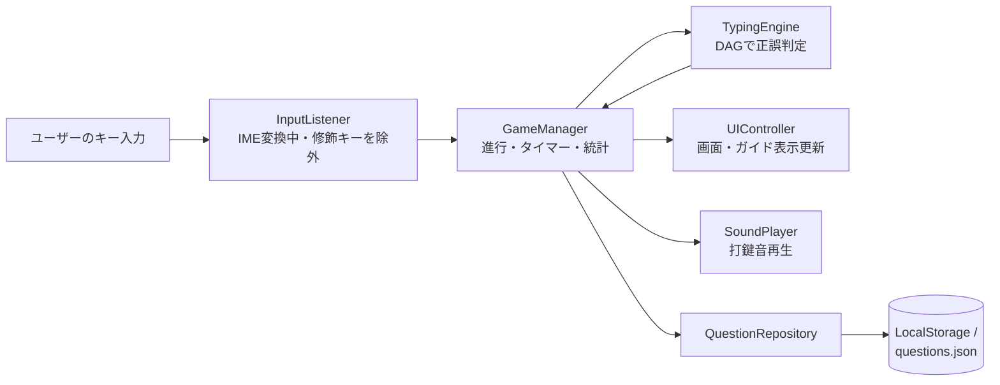

# ネオンタイピング（NEON TYPING）

IT用語を題材にした、ブラウザで動くタイムトライアル形式の日本語タイピングゲームです。ダークテーマ×ネオン調のデザインで、10問クリアまでのタイムを競います。

🎮 公開ページ: `https://otonasi-muonn.github.io/typing_game/`

## 概要

タイピング練習をしたい人（特にIT用語に親しみたいエンジニア・学習者）向けに、インストール不要・サーバー不要で遊べるタイピングゲームを提供します。

HTML / CSS / JavaScript のみの静的構成なので、GitHub Pages などの無料ホスティングにそのまま公開でき、さらに `index.html` をダブルクリックして開くだけ（`file:///` 接続）でも動作するように設計されています。

## 開発背景

「Mytyping（マイタイピング）風」のタイピングゲームを、サーバーを使わない低コストな構成で作ることを目的に開発されました（詳細は `docs/` 内の仕様書を参照）。

当初は「30秒制限時間制」でしたが、競技性と爽快感を高めるため「10問タイムトライアル制」に変更されています。また、ローカル環境で直接HTMLを開くとESモジュールや`fetch`がブラウザのセキュリティ制限（CORS）でブロックされる問題に対応するため、あえてESモジュールを使わず全ロジックを1つのJSファイルに集約し、各所にフォールバック処理を実装しています。

## メイン機能

- **10問タイムトライアル**
  ランダムに選ばれたIT用語10問（設定で変更可）をタイピングし、クリアまでの時間を競います。タイマーはスタートボタンではなく「最初の正しいキー入力」で始動するため、プレイヤーは準備を整えてから計測を開始できます。

- **ローマ字入力の揺れを自動判定**
  「し」→ `si` / `shi`、「つ」→ `tu` / `tsu`、「っ」→ 子音の重ね打ち、「ん」→ `n` / `nn` / `xn` など、日本語ローマ字入力の一般的な揺れをすべて許容します。内部では、かな文字列から有向非巡回グラフ（DAG）を構築し、複数の入力候補を並行して追跡することで実現しています（詳細は「技術的な見どころ」参照）。

- **リアルタイムのローマ字ガイド表示**
  画面には「入力済み／次に打つ文字／残り」の3色に分割されたローマ字ガイドが表示され、入力の揺れに応じて表示パターンも動的に切り替わります。

- **リザルト画面での成績表示**
  クリアタイム、秒間打鍵数（SPS: Strokes Per Second、1秒あたりの正解打鍵数）、正確率、正解数・ミス数を集計して表示します。

- **問題の追加・削除（隠し設定モーダル）**
  スタート画面右下の目立たない⚙ボタンから設定モーダルを開き、問題の追加・削除と出題数の変更ができます。追加した問題はブラウザのLocalStorage（ブラウザ内にデータを保存する仕組み）に永続化されるため、静的ホスティングでもリロード後にデータが維持されます。よみがなは「ひらがな・長音・読点類のみ」の正規表現バリデーション付きです。

- **打鍵音の再生**
  Web Audio API を使い、打鍵のたびに効果音を低遅延で再生します。音声ファイルが読み込めない環境では自動的に無音モードで続行します。

## 使い方

1. `index.html` をブラウザで開く（またはGitHub Pagesの公開URLにアクセスする）
2. スタート画面で遊び方を確認し、「ゲームスタート」ボタンを押す
3. 表示された日本語ワードを、ローマ字ガイドを参考にキーボードでタイピングする（最初の正しい入力でタイマーが始動）
4. 10問クリアするとリザルト画面に遷移し、タイム・SPS・正確率などが表示される
5. 「もう一度遊ぶ」で問題を再シャッフルして再挑戦できる

問題を編集したい場合は、スタート画面右下の⚙ボタンから設定モーダルを開いてください。

## 技術スタック

| 分類 | 技術 | 用途 |
| --- | --- | --- |
| 言語 | HTML5 / CSS3 / JavaScript (ES2015+) | 画面構造・スタイル・ゲームロジック |
| 音声 | Web Audio API | 打鍵音の低遅延再生 |
| データ保存 | LocalStorage / JSON (`questions.json`) | 問題データの読み込みと永続化 |
| フォント | Google Fonts (Outfit / Inter / Noto Sans JP) | ネオン調UIのタイポグラフィ |
| インフラ | GitHub Pages (GitHub Actions `static.yml`) | 静的サイトとしての自動デプロイ |
| テスト | Node.js 標準モジュール (`assert`) | 判定エンジン・ゲーム進行の自動テスト |

フレームワークやビルドツールは使用していません。

## 技術選定の理由

- **フレームワークなしの素のJavaScript構成**: サーバー処理を必要とせず、GitHub Pagesで低コストにホスティングするためです。さらに、ESモジュールを使わず全ロジックを `js/game.js` に集約することで、Webサーバーを立てずに `file:///` で直接開いてもCORSエラーで壊れない「ローカル起動耐性」を確保しています。
- **Web Audio API（`<audio>`タグではなく）**: 高速連打時にも遅延なく効果音を重ねて再生するため、デコード済みのバッファから都度SourceNodeを生成する方式を採用しています。
- **LocalStorage**: 静的ホスティングにはデータベースを置けないため、ユーザーごとの問題カスタマイズをブラウザ内保存で実現しています。

## 技術的な見どころ

### 1. DAG（有向非巡回グラフ）によるローマ字判定エンジン

**何を実現しているか**: 「しんかんせん」を `sinkansenn` でも `shinnkannsennn` でも正しく判定できる、入力揺れに完全対応した判定エンジンです（`js/game.js` の `TypingEngine` クラス）。

**なぜ難しいか**: 日本語のローマ字入力は1つのかなに複数の綴りがあるうえ、「ん」や「っ」は次の文字によって打ち方が変わります。単純な「正解文字列との一致比較」では、ユーザーがどの綴りを選ぶか事前に分からないため破綻します。

**どう実装しているか**: かな文字列の各位置を「ノード」、ローマ字の綴りを「エッジ」とするグラフを問題ごとに構築します（`buildDAG()`）。拗音（「しゃ」など2文字単位）のエッジ、促音「っ」の子音重ねエッジ（`tta`）、撥音「ん」の `n`+次の文字のショートカットエッジ（`nka`）を動的に生成し、キー入力のたびに有効な候補エッジ群（`activeEdges`）を絞り込んでいきます。

**効果**: どの綴りで打ち始めても途中で破綻せず、ガイド表示も実際の入力経路に追従します。`ROMAN_MAP` に無い文字（英数字・記号）は小文字化してそのままエッジ登録するフォールバックがあるため、「API」のような英字混じりの問題にも対応できます。

### 2. 「ん」の並行エッジのマージロジック

**何を実現しているか**: 「おんな」を `onna`（n単体）・`onnna`（nn）・`oxnna`（xn）のどれで打っても正しく判定します。

**なぜ難しいか**: 短いエッジ（`n`）が完了した時点でノードを先に進めると、まだ入力途中の長いエッジ（`nn` / `xn`）が破棄されてしまい、`onnna` と打とうとしたユーザーの2打目の `n` がミス判定になってしまいます。

**どう実装しているか**: `inputKey()` 内でエッジ完了時に、進行中の長いエッジ（`ongoing`）を破棄せず、遷移先ノードから新しく出るエッジ群と重複排除しながらマージして並行追跡を続けます（`js/game.js:206-219`）。

**効果**: どの経路を選んでもリアルタイムに判定が追従し、すべての入力パターンを破綻なく受け付けられます。この挙動は `scratch/test-typing-engine.js` の自動テストで検証されています。

### 3. requestAnimationFrame による高精度タイマーと計測開始の設計

**何を実現しているか**: 小数点2桁（10ミリ秒単位）でリアルタイム更新されるタイムトライアル用タイマーです。

**なぜ重要か**: `setInterval` は誤差が蓄積しやすく、タイムアタックの計測には不向きです。また、スタートボタン押下から計測を始めると「構えるまでの時間」がタイムに含まれてしまいます。

**どう実装しているか**: 高精度時刻 `performance.now()` を基準に、描画レートに同期する `requestAnimationFrame` のループで経過時間を再計算・表示します（`startTimer()`）。タイマーの起動は「最初の正しいキー入力」をトリガーにし、最終問題のクリア瞬間に `cancelAnimationFrame` で停止します。SPS計算では経過時間が0.01秒以下の場合に0を返すゼロ除算対策も入れています。

**効果**: 累積誤差のない正確なタイム計測と、プレイヤーの体感に合ったフェアな計測開始を両立しています。

### 4. 静的ホスティング・ローカル起動を前提とした多段フォールバック

**何を実現しているか**: サーバーなし（`file:///` 直接起動）でも、音声ファイルや問題JSONの読み込みに失敗しても、ゲームが必ず動く堅牢性です。

**なぜ重要か**: 静的サイトはfetch失敗・CORSブロック・ファイル名のエンコーディング差異（macOSのNFD問題)など、実行環境による失敗要因が多く、1つの失敗でゲーム全体が止まると使い物になりません。

**どう実装しているか**:
- 問題データは「LocalStorage → `questions.json` のfetch → コード内のフォールバック20問」の3段階で読み込みます（`QuestionRepository.loadQuestions()`）。
- 効果音ファイルは日本語ファイル名のため、NFC/NFD両方の正規化形式でfetchを順次試行し、すべて失敗した場合は無音モードに切り替えてゲームを続行します（`SoundPlayer`）。
- 登録される問題のよみがなは `normalize("NFC")` で正規化し、OS間の濁点表現の差異による判定不具合を防ぎます。

**効果**: ネットワークやサーバーの有無に関わらず、どの環境でも「開けば遊べる」状態を保証しています。

## 処理の流れ



`js/game.js` 内の6クラスが役割分担しており、`DOMContentLoaded` 時に相互接続されて起動します。

## 環境構築

### 必要なもの

- モダンブラウザ（Chrome / Edge / Firefox など）のみ。ビルドやパッケージインストールは不要です。
- 自動テストを実行する場合のみ Node.js が必要です。

### 実行方法

```bash
git clone https://github.com/otonasi-muonn/typing_game.git
cd typing_game
```

そのまま `index.html` をブラウザで開けば動作します。ローカルサーバー経由で開く場合は次のいずれかを使います（`questions.json` と効果音のfetchが有効になります）。

```bash
# Python の場合
python3 -m http.server 8000

# Node.js の場合
npx serve .
```

ブラウザで `http://localhost:8000` を開いてください。

### テストの実行

```bash
node scratch/test-typing-engine.js
```

判定エンジン（「し」「っ」「ん」の入力揺れ、ショートカットエッジ等）とタイムトライアル動作に関する全14項目のテストが、DOM・LocalStorageのモック環境下で実行されます。

### デプロイ

`main` ブランチにpushすると、GitHub Actions（`.github/workflows/static.yml`）がリポジトリ全体をGitHub Pagesへ自動デプロイします。

## ディレクトリ構成

```text
typing_game/
├── index.html                  # 画面構造（スタート/プレイ/リザルト/設定モーダル）
├── style.css                   # ネオン調のUIデザイン・アニメーション
├── questions.json              # 初期問題データ（IT用語20問）
├── タイピング-パンタグラフ単1.mp3  # 打鍵効果音
├── js/
│   └── game.js                 # 全ゲームロジック（6クラス構成）
├── scratch/
│   └── test-typing-engine.js   # Node.jsで動く自動テスト
├── docs/                       # 仕様書・開発記録
└── .github/workflows/
    └── static.yml              # GitHub Pagesへの自動デプロイ
```

## 今後の改善点

- `.github/workflows/npm-publish-github-packages.yml` はNode.jsパッケージ公開用のワークフローですが、リポジトリに `package.json` が存在しないため、リリース作成時に実行しても失敗します。本プロジェクトは静的サイトのため、削除するか `package.json` の整備が必要です。
- 設定モーダルには「初期データに戻す」機能がないため、LocalStorageに保存した問題をリセットするにはブラウザの開発者ツールから削除する必要があります。
- ハイスコア（自己ベストタイム）の保存機能は未実装です。
