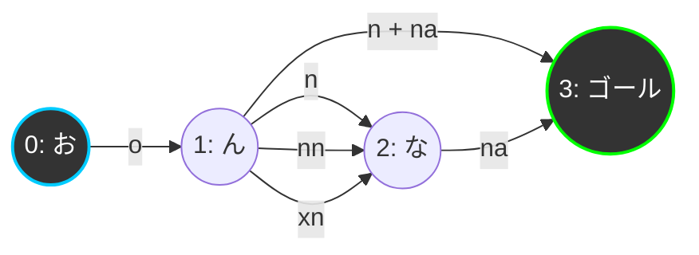

# タイピングゲーム 仕様書・導入マニュアル

本ドキュメントは、再設計および実装に基づいてアップデートされた「NEON TYPING（Mytyping風タイピングゲーム）」のシステム仕様、アーキテクチャ、ゲームの仕様、および GitHub Pages への公開手順をまとめた仕様書・導入マニュアルです。

---

## 1. プロジェクトの概要と背景

### 1.1 開発目的
本プロジェクトは、Webブラウザ上で動作する「Mytyping（マイタイピング）風タイピングゲーム」の開発を目的としています。
HTML5/CSS3/JavaScriptによる静的フロントエンド構成を採用し、サーバー側の処理を必要としないため、低コストかつ手軽に **GitHub Pages** などでホスティング可能です。

### 1.2 ユーザー体験とタイムトライアル制への変更
ゲームプレイの軽快さと爽快感を高めるため、より競技性の高いタイピング体験を提供するため、従来の「30秒制限時間制」から**「10問タイムトライアル制」**へとシステムを変更しました。
- **高精度タイマー**: ミリ秒単位でのタイムアタックを可能にするため、小数点2桁表示の高精度タイマーを導入しました。
- **入力揺れの完全許容**: 日本語ローマ字入力における多様な綴り（例：「し」を `si` / `shi` / `ci`、「ん」の入力揺れなど）をすべて検知・許容します。
- **低遅延の打鍵音再生**: 打鍵時のレスポンスを向上させるための低遅延オーディオ再生（Web Audio API）。

### 1.3 ローカル起動への耐性（ESMの廃止）
ブラウザのセキュリティ制限（CORSポリシー）により、ローカル環境でHTMLファイルを直接ダブルクリックして起動（`file:///` 接続）した場合、ESモジュール（ESM）のインポート処理や外部アセットのFetch処理がブロックされます。
本プロジェクトでは、コードを単一のJavaScriptファイルに集約し、ESMを廃止することで、ネットワーク環境やWebサーバーがないローカル環境でもスムーズに起動できる「ローカル起動耐性」を確保しました。

---

## 2. システム仕様とアーキテクチャ

### 2.1 ディレクトリ構成と各ファイルの責務

プロジェクトのルートディレクトリは以下の構成になっています。

```text
typing_game/
├── index.html                           # ゲーム画面のHTML骨格
├── style.css                            # UIデザインおよびアニメーションスタイル
├── questions.json                       # タイピング問題のデータ（JSON）
├── タイピング-パンタグラフ単1.mp3       # 打鍵時の効果音ファイル（mp3）
├── docs/
│   └── 20260717_typing_game_documentation.md # 本仕様書（本書）
└── js/
    └── game.js                          # 全ロジックを集約した通常スクリプトファイル
```

#### 各コンポーネントの責務（`js/game.js` 内に集約）
1. **`TypingEngine`**: ひらがなからDAG（有向非巡回グラフ）を構築し、ローマ字入力を動的に判定するエンジン。
2. **`SoundPlayer`**: Web Audio API を用いて打鍵音を低遅延で再生するモジュール。
3. **`QuestionRepository`**: 問題データの読み込みとFetchエラー時のフォールバック処理。
4. **`UIController`**: DOMの表示切り替え、表示更新、ミスエフェクトの制御。
5. **`InputListener`**: キーボード入力イベントの監視とフィルタリング。
6. **`GameManager`**: ゲームの進行、状態遷移（ステート管理）、スコア算出、高精度タイマーの制御。

---

### 2.2 タイムトライアル高精度タイマーとWPM計算

#### 2.2.1 高精度カウントアップタイマー
- **描画・計測**: `requestAnimationFrame` と `performance.now()` を組み合わせて、ブラウザの描画レートに同期した高精度な時間計測を行います。
- **トリガー**: 画面上のスタートボタンを押した時点ではタイマーは動作せず、**「ゲーム開始後の最初の正しいキー入力」**を検知した瞬間にタイマーが起動します。これにより、プレイヤーが準備を整えてから計測を開始できます。
- **自動停止**: 10問目の最後の文字が正しく入力され、問題クリアとなった瞬間にタイマーを停止（`cancelAnimationFrame`）し、最終タイムを確定させます。

#### 2.2.2 WPM計算とゼロ除算防止
WPM（Words Per Minute：1分間あたりの正確な打鍵数）は、タイピング速度を測定する世界的な指標です。
- **計算式**:
  $$\text{WPM} = \frac{\text{正解キー打鍵数}}{\text{クリア秒数}} \times 60$$
- **例外処理とゼロ除算防止**:
  極端に高速でクリアした場合や、デバッグ中に一瞬でゲームが終了した場合など、経過時間が極小（0.01秒以下）の際には、計算時にゼロ除算や無限大（`Infinity`）が発生するリスクがあります。
  これを防止するため、経過時間が `0.01` 秒以下の場合には WPM を強制的に `0` と判定する防衛コードを実装しています。
  ```javascript
  const wpm = time > 0.01 ? Math.round((this.correctCount / time) * 60) : 0;
  ```

---

### 2.3 ローマ字判定エンジンのアルゴリズム（DAG構築）

`js/game.js` の `TypingEngine` クラスは、日本語タイピング特有の複雑な入力揺れを解決するため、**DAG（有向非巡回グラフ）** による判定エンジンを採用しています。



#### 2.3.1 判定ロジックと入力揺れの許容
ひらがな1文字あるいは2文字（拗音）に対して、対応する複数のローマ字パターンを定義した `ROMAN_MAP` を保持しています。
- **グラフ構築**: 問題のひらがな文字列を解析し、各ひらがな位置を「ノード」、ローマ字スペルを「エッジ（遷移）」とするDAGを構築します。
- **並行パスの追跡**: ユーザーのキー入力に応じて、現在有効なすべての遷移パス（`activeEdges`）を同時に追跡します。

#### 2.3.2 撥音「ん」におけるショートカットエッジとマージロジック
「ん」の入力揺れ（`n` が単体で許容されるケース、`nn` や `xn` が必要なケース）に完全対応するため、本エンジンでは**「ショートカットエッジの動的生成」**と**「並行エッジのマージロジック」**を実装しています。

1. **ショートカットエッジ（`n` ＋ 次のローマ字）の動的生成**:
   「ん」の次の文字の先頭が母音（`a, i, u, e, o`）やヤ行（`y`）以外の場合、「ん」を `n` 単体で確定させ、そのまま次の文字を入力できます（例：「おんな」で `onna` と打つケース）。
   このため、エンジン構築時に「『ん』を表す `n`」＋「次の文字のローマ字スペル `r`」を結合したエッジ（`n` + `r`）を動的に追加します。
2. **並行エッジのマージロジック**:
   プレイヤーが「ん」を入力するとき、`nna`（`n` 単体確定＋「な」）、`nnna`（`nn` 確定＋「な」）、`xnna`（`xn` 確定＋「な」）のいずれの経路でタイピングするかはリアルタイムで変化します。
   従来のエンジンでは、短いエッジ（`n` など）が完了してノードが次の「な」へ遷移した際、まだ完了していない長いエッジ（`nn` や `xn` などの進行中エッジ `ongoing`）が破棄されてしまい、判定が破綻する問題がありました。
   これを解決するため、**エッジ完了時にも現在進行中のより長いエッジ（ongoing）を破棄せずに、遷移先のノードから新しく出現するエッジ群とマージして並行追跡し続けるロジック**を実装しました。
   ```javascript
   // 次のノードに進むが、現在進行中のより長いエッジ（ongoing）も引き継いでマージする
   const nextActiveEdges = [...ongoing];
   const newEdges = this.nodes[this.currentNode] || [];
   const newActive = newEdges.map(edge => ({ edge, typedLength: 0 }));
   
   // 重複を排除してマージ
   for (const na of newActive) {
     if (!nextActiveEdges.some(ae => ae.edge.start === na.edge.start && ae.edge.end === na.edge.end && ae.edge.label === na.edge.label)) {
       nextActiveEdges.push(na);
     }
   }
   this.activeEdges = nextActiveEdges;
   ```
   これにより、`onna`, `onnna`, `oxnna` のすべての入力パターンを完全に破綻なく並行処理することが可能になりました。

#### 2.3.3 促音（っ）の特殊処理
ひらがな中の「っ」を検出した際、単に「っ」単体（`ltu`, `xtu`, `ltsu`）のエッジを構築するだけでなく、**「っ」の次の文字の最初の子音を重ねて入力するエッジ**を動的に追加します。
- **処理内容**: 次の文字のエッジの先頭文字が子音（`aiueoyn-xl` 以外）である場合、その子音を重ねた文字列（例：「た」の `ta` に対し `tta`）のエッジを「っ」のノードから接続します。

#### 2.3.4 未定義文字のフォールバック
`ROMAN_MAP` に存在しない文字（アルファベット、数字、記号、スペースなど）が問題文に含まれている場合は、その文字自体（小文字化）をエッジとしてDAGに登録します。これにより、日本語以外の文字が混在した問題文もそのままタイピング可能です。

---

### 2.4 ローカル起動とフォールバック処理

本システムは、Webサーバーを通さずにローカルのファイルシステムから直接ブラウザに読み込ませた場合（`file:///` 接続）でも動作するよう、徹底したエラーハンドリングとフォールバック処理を実装しています。

#### 2.4.1 問題データのフォールバック（`QuestionRepository`）
通常、問題データは `questions.json` から `fetch` で取得しますが、ローカル環境ではCORSエラー等により `fetch` が失敗します。
この時、例外をキャッチして即座にクラス内部に定義された **`fallbackQuestions`（IT用語のタイピングデータ20件）** を読み込むように設計されています。これにより、外部JSONが読み込めなくても問題なくゲームをプレイできます。

#### 2.4.2 音声再生のフォールバックと無音進行（`SoundPlayer`）
打鍵音ファイル（`タイピング-パンタグラフ単1.mp3`）も同様にローカル起動時には `fetch` がブロックされます。
音声ロード処理の中で例外が発生した場合は、エラーをコンソールに警告出力した上で、内部フラグ（`isSoundEnabled = false`）を立て、**「無音状態でのゲーム進行」**へと安全に切り替えます。ゲーム全体の進行やタイピング判定がフリーズすることはありません。

#### 2.4.3 NFD / NFC 濁点対応
macOSなどのファイルシステムの仕様により、濁点付き日本語文字が **NFD（結合文字）** としてエンコードされ、サーバー上で404エラーになる現象を防止するため、`SoundPlayer` は `fetch` 時に自動的に以下の複数のファイル名表記候補を配列として作成し、正常にロードできるまで順次フォールバックを試みます。
1. `タイピング-パンタグラフ単1.mp3`（元のファイル名表記）
2. `normalize('NFC')` を施した文字列
3. `normalize('NFD')` を施した文字列

---

## 3. ゲームの遊び方と操作マニュアル

### 3.1 画面遷移と画面構成

ゲームは以下の3つの状態（画面セクション）を切り替えることで動作します。

```text
  [ スタート画面 ]
         │ (STARTボタン押下)
         ▼
  [ プレイ画面 (10問完了まで) ]
         │ (最初の正しい入力でタイマー開始、10問目で自動停止)
         ▼
  [ リザルト画面 ]
         │ (PLAY AGAINボタン押下)
         ▼
  [ プレイ画面 (再スタート) ]
```

1. **スタート画面 (`screen-idle`)**
   - ゲームタイトルと遊び方の簡潔な説明（タイムトライアル制であることなど）が表示されます。
   - 「CHALLENGE START」ボタンをクリックするとゲームプレイ画面に切り替わります（同時にWeb Audio APIの自動再生ブロック解除処理が走ります）。
2. **プレイ画面 (`screen-playing`)**
   - **問題文エリア**: 漢字表記と、その下に現在の入力状況を示すローマ字ガイドが表示されます。
     - **緑色（`char-typed`）**: 入力完了したローマ字
     - **黄色（`char-current`）**: 入力中エッジの未打鍵部分（次の1文字）
     - **白色（`char-remaining`）**: 残りの入力待ちローマ字
   - **ステータスエリア**: TIME (秒)、CLEARED (クリア問題数)、CORRECT (正解打鍵数)、MISS (ミス打鍵数) がリアルタイムで表示されます。
3. **リザルト画面 (`screen-completed`)**
   - 10問目をクリアした瞬間に自動的に遷移し、以下のスコア統計情報が表示されます。
     - **TIME**: 10問完了までの総経過時間（秒）。
     - **WPM**: 1分間あたりの平均正確打鍵数（タイピング速度）。
     - **ACCURACY**: 入力全体の正確性（パーセンテージ）。
     - **CORRECT / MISS**: 正解打鍵数とミス打鍵数の累計値。
     - **CLEARED**: クリアした問題数（`10/10`）。
   - 「PLAY AGAIN」ボタンをクリックすると、即座に新しい問題シャッフルでゲームが再スタートします。

### 3.2 UI文言の英語/日本語調和デザイン
ゲームのビジュアルは、ダークテーマを基調としたネオン調のサイバーパンク風デザインを採用しています。これに合わせて、UI内の文字配置も英語と日本語の調和を重視した設計になっています。
- **英語の成績指標**: `TIME`, `WPM`, `ACCURACY`, `CLEARED`, `CORRECT`, `MISS` などの主要な指標は、洗練されたフォント（`Outfit` / `Inter`）を使用し、スタイリッシュな大文字英語で統一しています。
- **日本語の説明文**: 「HOW TO PLAY（遊び方）」カードの説明文や、「キーボードを直接タイピングしてください」といった案内は、可読性の高い `Noto Sans JP` を使用し、デザインのトーンを崩さない日本語表記で配置しています。
- **ミスフィードバック**: タイピングミスが発生した際、画面全体（`game-container`）の枠線や背景を赤く明滅させ、わずかに画面を左右に揺らすアニメーション（`miss-flash`）をトリガーし、ネオンデザインと連動した視覚効果を演出します。

---

## 4. GitHub Pages への公開・デプロイ手順

本ゲームは静的なHTML/CSS/JS/JSONのみで構成されているため、GitHubが提供する静的サイトホスティングサービス「GitHub Pages」で簡単に公開可能です。

### 4.1 事前準備
1. GitHub アカウントを所有していることを確認します。
2. GitHub 上に新しくパブリック（Public）な空のリポジトリ（例: `typing-game`）を作成します。

### 4.2 ローカルでの Git コマンド実行手順
プロジェクトのローカルディレクトリでターミナル（PowerShell等）を開き、以下のコマンドを順に実行してソースコードを GitHub にプッシュします。

```powershell
# 1. ローカルリポジトリの初期化
git init

# 2. すべてのファイルをステージングエリアに追加
git add .

# 3. コミットを作成
git commit -m "feat: 10問タイムトライアル制とローカル起動サポートのアップデート"

# 4. メインブランチの名前を main に設定
git branch -M main

# 5. リモートリポジトリ（GitHub）のURLを設定（ユーザー名とリポジトリ名は環境に合わせる）
git remote add origin https://github.com/【あなたのGitHubユーザー名】/【作成したリポジトリ名】.git

# 6. リモートリポジトリにプッシュ
git push -u origin main
```

### 4.3 GitHub Pages の有効化設定
1. ブラウザで GitHub 上の対象リポジトリのページにアクセスします。
2. 右上にある「**Settings**（設定）」タブをクリックします。
3. 左側のメニューリストから「**Code and automation**」配下にある「**Pages**」をクリックします。
4. **Build and deployment** セクションで以下のように設定します。
   - **Source**: `Deploy from a branch` (初期選択)
   - **Branch**: デプロイ元として `main` ブランチを選択し、フォルダは `/ (root)` を指定します。
5. 「**Save**」ボタンをクリックします。

### 4.4 公開の確認
- 保存後、画面上部に黄色の案内が表示され、数分で緑色に変わり公開URLが表示されます。
- 公開URLの形式は以下のようになります：
  `https://【あなたのGitHubユーザー名】.github.io/【リポジトリ名】/`
- 表示されたURLにブラウザから直接アクセスし、ゲームが正常に動作するかを確認してください。
